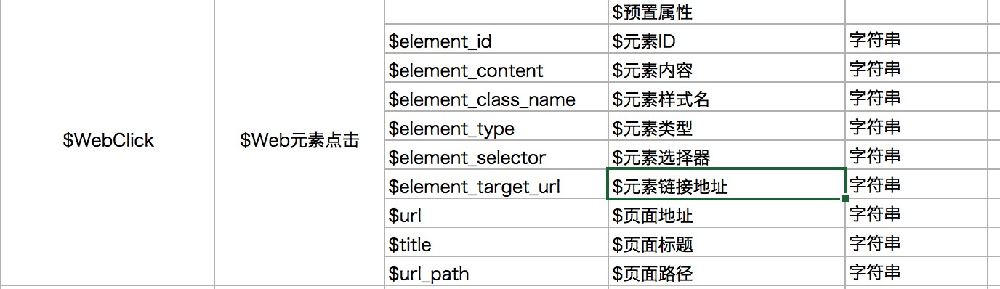

# js sdk 源码分析

$pageview

$WebClick

最近一次流量来源类型判定逻辑

```
_.getSourceFromReferrer = function(){
  function getMatchStrFromArr(arr,str){
    for(var i = 0; i<arr.length; i++){
      if(str.split('?')[0].indexOf(arr[i]) !== -1){
        return true;
      }
    }
  }

  var search_engine = ['www.baidu.','m.baidu.','m.sm.cn','so.com','sogou.com','youdao.com','google.','yahoo.com/','bing.com/','ask.com/'];
  var social_engine = ['weibo.com','renren.com','kaixin001.com','douban.com','qzone.qq.com','zhihu.com','tieba.baidu.com','weixin.qq.com'];

  var referrer = document.referrer || '';
  var url = _.info.pageProp.url;
  if(url){
    var utm_match = url.match(/(utm_source|utm_medium|utm_campaign|utm_content|utm_term)\=[^&]+/);    
    if(utm_match && utm_match[0]){
      return '付费广告流量';
    }else if(getMatchStrFromArr(search_engine,referrer)){
      return '自然搜索流量';
    }else if(getMatchStrFromArr(social_engine,referrer)){
      return '社交网站流量';
    }else if(referrer === ''){
      return '直接流量';
    }else{
      return '引荐流量';
    }
  }else{
    return '获取url异常';
  }
};

```

最后一次广告相关逻辑

```
checkIsFirstLatest: function() {
    var url_domain = _.info.pageProp.url_domain;
    var referrer_domain = _.info.pageProp.referrer_domain;

    //去除详叔的坑，utm_source相关   
     var latest_utms = ['$utm_source','$utm_medium', '$utm_campaign', '$utm_content', '$utm_term'];   
     var props = store.getProps();
     for(var i =0;i<latest_utms.length;i++){   
       if(latest_utms[i] in props){    
         delete props[latest_utms[i]];   
       }   
     }   
     store.setProps(props,true);


    // 判断最近一次，如果前向地址跟自己域名一致，且cookie中取不到值，认为有异常
    // 最近一次站外前向地址，如果域名不一致，就register为latest
    if(url_domain !== referrer_domain){
      sd.register({
        $latest_traffic_source_type:_.getSourceFromReferrer(),
        $latest_referrer: _.info.pageProp.referrer,
        $latest_referrer_host: _.info.pageProp.referrer_host,
        $latest_search_keyword: _.getKeywordFromReferrer()        
      });
    }
    // utm
    var allUtms = _.info.campaignParamsStandard('$latest_','_latest_');
    var $utms = allUtms.$utms;
    var otherUtms = allUtms.otherUtms;
    if (!_.isEmptyObject($utms)) {
      sd.register($utms);
    }
    if (!_.isEmptyObject(otherUtms)) {
      sd.register(otherUtms);
    }
};

```

WebClick


获取点击元素信息
```
// 获取元素的一些信息
_.getEleInfo = function(obj){
  if(!obj.target){
    return false;
  }

  var target = obj.target;
  var tagName = target.tagName.toLowerCase();


  var props = {};

  props.$element_type = tagName;
  props.$element_name = target.getAttribute('name');
  props.$element_id = target.getAttribute('id');
  props.$element_class_name = typeof target.className === 'string' ? target.className : null;
  props.$element_target_url = target.getAttribute('href');

  // 获取内容
  
  var textContent = '';
  if (target.textContent) {
    textContent = _.trim(target.textContent);
  }else if(target.innerText){
    textContent = _.trim(target.innerText);
  }
  if (textContent) {
    textContent = textContent.replace(/[\r\n]/g, ' ').replace(/[ ]+/g, ' ').substring(0, 255);
  }
  props.$element_content = textContent || '';

  // 针对inut默认只采集button和submit非名感的词汇。可以自定义（银联提）
  if(tagName === 'input'){
    if(target.type === 'button' || target.type === 'submit'){
      props.$element_content = target.value || '';
    } else if (sd.para.heatmap && (typeof sd.para.heatmap.collect_input === 'function') && sd.para.heatmap.collect_input(target)){
      props.$element_content = target.value || '';
    }
  }

  props = _.strip_empty_properties(props);

  props.$url = location.href;
  props.$url_path = location.pathname;
  props.$title = document.title;

  return props;

};


```

webclick 预置采集的是 a input button
如果想采集其他元素比如:icon、span、img之类的元素点击情况，可以写代码如下：

```
// 下面演示点击图片的时候也触发点击图事件
$('img').on('click',function(){
    sa.track('img',{position:'头部'});; //第二个参数是发生事件的dom元素
});

```

