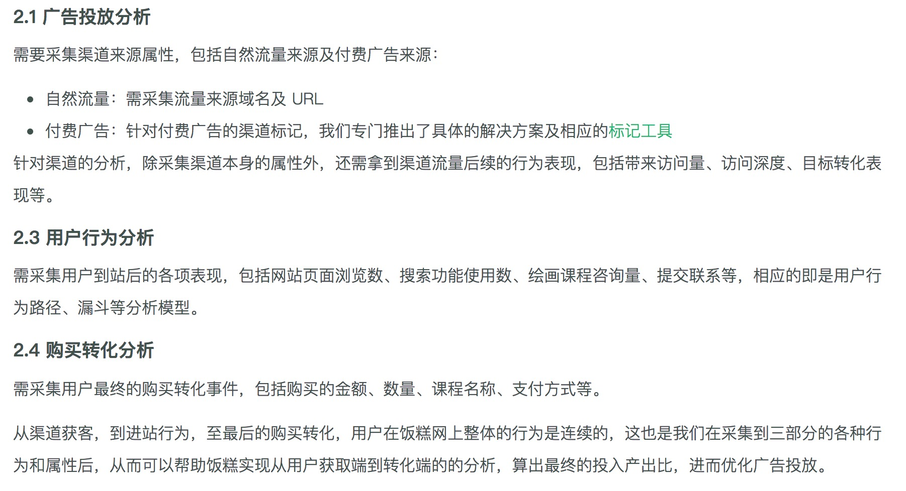
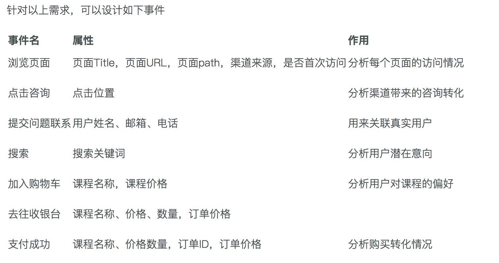

# 事件设计中的应用

sa方法:
```
- sa.login(user_id) --把SDK自动生成的cookie_id关联成现在传入的user_id，且以后一直会使用这个user_id
- sa.identify(id) --修改匿名id。默认情况下，把cookie_id作为distinct_id。如果能取到其他id作为匿名id，可以通过该方法修改
- sa.logout() --sa.logout():取消当前login的id，改成最初自从生成的cookie_id;sa.logout(true):取消当前login的id，重新生成一个新的cookie_id
- sa.track('event',properties) --自定义事件追踪
- sa.registerPage(Object) --设置公共属性

- sa.setProfile() --直接设置用户的属性，存在则覆盖
- sa.setOnceProfile() --设置用户属性，不存在则设置，存在就不设置
- sa.appendProfile() --给数组添加属性值
- sa.increcementProfile() --对当前用户的属性做递增或递减
- sa.deleteProfile() --删除当前这个用户及他的所有属性
- sa.unsetProfile() --删除当前用户的一些属性

```

1.以我们技术文档中
[饭糕网](http://www.fangao.cc/)
的前端埋点举例，看程序员们是如何写前端埋点代码的

2.需求分析：



3.事件设计



4.前端埋点

```

  sa.quick('autoTrack');//开启自动采集
  jQuery(function(){
    var $ = jQuery;
    //qq上    
    $('#menu-item-15213').on('click',function(){
      sa.track('qq_talk',{path:location.pathname,position:'头部'});
    });
    //qq右    
    $(document).on('click','#scrightdown',function(){
      sa.track('qq_talk',{path:location.pathname,position:'右侧'});
    });
    $(document).on('click','.pop-cover a img',function(){
      sa.track('qq_talk',{path:location.pathname,position:'中间'});
    });
    $(document).on('click','#hidden-wx-a',function(){
      sa.track('qq_talk',{path:location.pathname,position:'留言'});
    });
    $(document).on('click','#tan-qq-1',function(){
      sa.track('qq_talk',{path:location.pathname,position:'预约'});
    });

   //购物车
    if(location.pathname === '/course'){
      $(document).on('click','.to-pay',function(){ 
    	var qq = $('#qq-cart').val();
    	if(/^\d{5,10}$/.test(qq)){
    	    sa.track('to_pay',{path:location.pathname,userqq:qq});
    	    sa.trackSignup(qq,'trackSignupRegister');
    	}
      });      
    }

// reigster页面
  if(location.pathname === '/register'){
    $(document).on('click','input[type="submit"][value="提交"]',function(){
      var qq = $('input[type="text"][name="qqnumber"]').eq(0).val(); 
      var username = $('input[type="text"][name="username"]').eq(0).val(); 
      var list = [];
jQuery('.fangao-form section').slice(0,1).find('.wpcf7-list-item input:checked').each(function(a,b){ list.push($(b).val()) })

      sa.track('success_buy_page',{buy_page_list:list});
      sa.trackSignup(qq,'trackSignupRegister');
      sa.setProfile({qq:String(qq),username:username,buy_page_list:list});	
    });
  }

// 付款成功页面
  if(location.pathname.indexOf('/checkout/order-received/') !== -1){

      var order_id = jQuery('.order_details .order strong').text();
      var order_date = jQuery('.order_details .date strong').text();
      var order_amount = parseInt(jQuery('.order_details .total strong').text().replace(/[^.0-9]/g,''));
      var order_product = jQuery('.order_details .order_item .product-name').text().replace(/\s/g,'').replace(/×\d+/,'');
      sa.track('success_buy',{order_id:order_id,order_date:order_date,order_amount:order_amount,order_product:order_product  })
   }

// 提交联系人
$('#contact-us #submit').on('click',function(){

     var name = $('#contact-us #name').val();
      var email = $('#contact-us #email').val();
      var cellphone = $('#contact-us #tel').val();
      var temp = email.replace(/@.+/g,'');
	var qq;
	if(/^\d+$/.test(temp)){qq = temp;}

  sa.track('place_contact',{email:email,cellphone:cellphone,u_name:name});
  qq && sa.trackSignup(qq,'trackSignupContact');
})
});


```