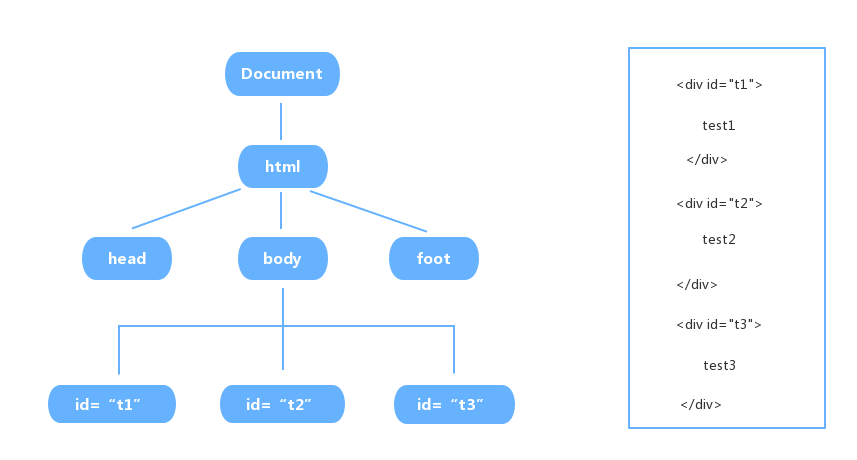
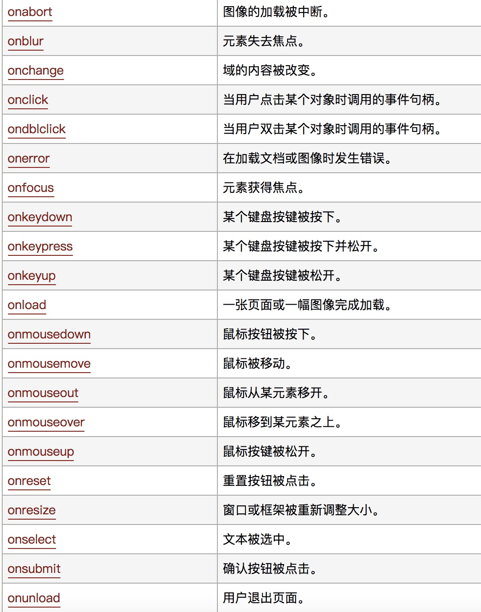

# DOM(Document Object Model，文档对象模型)

当网页被加载时，浏览器会创建页面的文档对象模型（Document Object Model）



```
var t1 = document.getElementById("t1");
console.log(t1.innerHTML);

>>>test1

```

- 通过 id 查找 HTML 元素：document.getElementById("main");
- 通过标签名查找 HTML 元素:document.getElementsByTagName("p");

DOM
html 元素
元素属性

- JavaScript 能够改变页面中的所有 HTML 元素
- JavaScript 能够改变页面中的所有 HTML 属性
- JavaScript 能够改变页面中的所有 CSS 样式
- JavaScript 能够对页面中的所有事件做出反应

## DOM操作HTML

- 往html中输入内容 

`document.write("text")`
- 改变html元素内容

`document.getElementById(id).innerHTML=new HTML`
- 改变html元素属性

`document.getElementById(id).attribute=new value`

## DOM操作CSS

改变html样式

`document.getElementById(id).style.property=new style`

## DOM操作事件

js实现交互比如添加点击：`<h1 onclick="this.innerHTML='谢谢!'">请点击该文本</h1>`

常见的事件如下:



## DOM操作节点

- 添加节点

```
<script>
var para=document.createElement("p");
var node=document.createTextNode("这是新段落。");
para.appendChild(node);

var element=document.getElementById("div1");
element.appendChild(para);
</script>

```

- 删除节点

```
<script>
var parent=document.getElementById("div1");
var child=document.getElementById("p1");
parent.removeChild(child);
</script>

```
